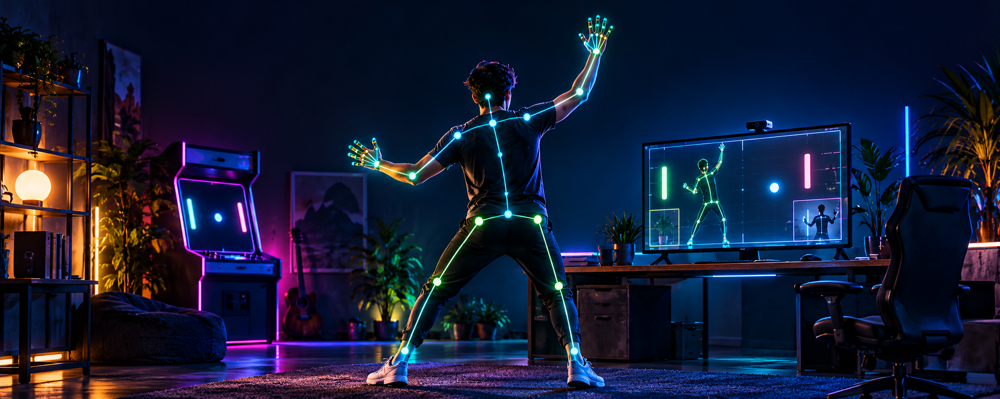
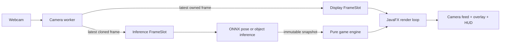

# VisionArcade

**Turn your webcam into a local, real-time arcade controller powered by computer vision.**

[](https://github.com/Bruce1508/VisionArcade/actions/workflows/build.yml)


<p align="center">
  
</p>

> Concept artwork. VisionArcade is a Java desktop application that turns live webcam frames into physical game controls. Camera capture, ONNX inference, game logic, and rendering all run locally—no backend, account, or cloud inference required.

> **Project status:** Milestone 9 implementation is complete. Live Pose Match gameplay still requires final end-to-end verification with a webcam on the primary development machine.

## 🚀 Features

- **Play with body movement** — match Arms Up, T-Pose, and One Leg Up challenges using a live 17-keypoint pose skeleton.
- **Hunt real-world objects** — detect supported household items and hold them in view long enough to score in Object Hunt.
- **Control Vision Pong physically** — move a paddle by standing, crouching, and shifting your detected body position.
- **React in real time** — discard stale camera frames through single-slot handoff instead of building a latency-heavy queue.
- **Run inference locally** — execute YOLO26n detection and pose models through the direct ONNX Runtime Java API.
- **Keep gameplay testable** — drive pure game state machines with deterministic detections, poses, and timestamps without a webcam.
- **Shut down cleanly** — release OpenCV frames, camera handles, workers, and ONNX sessions through explicit ownership rules.

> **Current mode:** all three game engines are implemented, but the application currently launches directly into **Pose Match**. An in-app mode selector is not implemented yet.

## 📦 Tech Stack

| Area | Technology | Role |
|---|---|---|
| Desktop UI | JavaFX 25.0.4 | Responsive camera preview, canvas overlays, HUD, and render loop |
| Application runtime | Java 25 LTS | Production runtime and concurrency model |
| Camera and image processing | OpenCV 4.14 via JavaCPP | Webcam capture, frame conversion, resize, and letterboxing |
| ML inference | ONNX Runtime Java 1.30.0 | Local CPU inference with direct Java bindings |
| Models | YOLO26n / YOLO26n-pose | COCO object detection and 17-keypoint human pose estimation |
| Game logic | Plain Java state machines | Object Hunt, Vision Pong, and Pose Match rules |
| ML tooling | Python 3.13, Ultralytics | Development-time model export and optional fine-tuning only |
| Build and test | Gradle 9.x wrapper, JUnit 6.1.3 | Reproducible builds, unit tests, and integration smoke tests |
| CI | GitHub Actions | Builds and tests pull requests and pushes to `main` |
| Data storage / backend | None | The app is local-first and keeps no accounts or persistent data |



The latest-frame design favors fresh input over processing every frame. It prevents inference slowdown from turning into steadily increasing gameplay latency.

## ⚙️ Getting Started

### Prerequisites

- **JDK 25 LTS**. Gradle can provision the configured toolchain, but a local Java runtime is still required to launch the wrapper.
- **A webcam** and permission for the terminal or IDE to access it.
- **Git** for cloning the repository.
- **Python 3.13** only when regenerating the gitignored ONNX model files.
- **Internet access** on the first build and model export to download dependencies and the pretrained checkpoint.

The primary development and live-camera environment is macOS on Apple Silicon. CI validates the non-hardware build on Ubuntu; live webcam behavior on other platforms has not yet been manually certified.

### Installation

1. Clone the repository:

   ```bash
   git clone https://github.com/Bruce1508/VisionArcade.git
   cd VisionArcade
   ```

2. Build the Java application with the repository wrapper:

   ```bash
   ./gradlew build
   ```

3. Export the pretrained Pose Match model. Model binaries are intentionally excluded from Git:

   ```bash
   mkdir -p models
   python3.13 -m venv ml/.venv
   source ml/.venv/bin/activate
   pip install -r ml/requirements.txt
   python ml/export/export_pose_onnx.py
   ```

4. Confirm that the expected model exists:

   ```bash
   test -f models/yolo26n-pose.onnx && echo "Pose model ready"
   ```

No environment variables, database, API key, or remote service are required. On first launch, allow camera access when macOS prompts for permission.

For the object-detection models and optional fine-tuning pipeline, follow [`ml/README.md`](ml/README.md). Model provenance, tensor shapes, export options, checksums, and licensing notes are documented in [`VisionArcade_docs/DEVELOPMENT.md`](VisionArcade_docs/DEVELOPMENT.md).

## 💻 Usage

Start the current Pose Match experience:

```bash
./gradlew run
```

Stand far enough from the webcam for your shoulders, wrists, hips, knees, and ankles to remain visible. Match the target shown in the HUD and hold the pose continuously for approximately **600 ms**. A round lasts **20 seconds**, and the next round starts after a **1.5-second** result display.

Run the automated test suite and production build:

```bash
./gradlew test
./gradlew build
```

Run the opt-in camera smoke test only on a machine where opening the webcam is acceptable:

```bash
./gradlew test \
  -Dvisionarcade.hardwareTests=true \
  --tests CameraCaptureSpikeTest
```

Create a local runnable distribution:

```bash
./gradlew installDist
./build/install/VisionArcade/bin/VisionArcade
```

The current distribution is intended for development validation and is large because its native dependency artifacts include multiple operating systems and CPU architectures. See [`VisionArcade_docs/BENCHMARKS.md`](VisionArcade_docs/BENCHMARKS.md) for measured performance and packaging notes.

## 📁 Project Structure

```text
VisionArcade/
├── src/
│   ├── main/java/org/example/visionarcade/
│   │   ├── app/       # JavaFX lifecycle and active game wiring
│   │   ├── camera/    # Webcam capture, frame ownership, latest-frame slots
│   │   ├── vision/    # ONNX detectors, pose estimation, decoding, tracking
│   │   ├── game/      # Pure Object Hunt, Vision Pong, and Pose Match engines
│   │   └── ui/        # Frame conversion, skeleton/box overlays, game HUDs
│   └── test/          # Unit, native-loading, inference, and gated camera tests
├── ml/
│   ├── export/        # Detection and pose checkpoint-to-ONNX scripts
│   └── training/      # COCO subset preparation and optional fine-tuning
├── models/            # Local ONNX artifacts; intentionally gitignored
├── VisionArcade_docs/ # PRD, architecture, roadmap, tasks, testing, benchmarks
├── docs/assets/       # README and project media
├── .github/workflows/ # CI build definition
├── build.gradle       # Pinned Java, JavaFX, OpenCV, ONNX, and JUnit setup
└── gradlew             # Required Gradle wrapper entry point
```

Start with [`VisionArcade_docs/PRD.md`](VisionArcade_docs/PRD.md), then read [`VisionArcade_docs/ARCHITECTURE.md`](VisionArcade_docs/ARCHITECTURE.md) and [`VisionArcade_docs/TASKS.md`](VisionArcade_docs/TASKS.md) before changing behavior. The project deliberately keeps camera, inference, game rules, and rendering in separate ownership boundaries.

## 🤝 Contributing

Contributions and focused issue reports are welcome. Keep changes aligned with the current milestone and preserve the latest-frame, local-inference, and explicit native-resource ownership constraints.

1. Fork the repository and clone your fork.
2. Create a focused branch: `git switch -c feature/short-description`.
3. Implement the smallest complete change and add behavior-focused tests.
4. Run `./gradlew build` before submitting.
5. Open an issue for defects or proposals that need design discussion.
6. Open a pull request that explains the user-visible result, verification performed, and any hardware limitations.

Avoid committing ONNX models, datasets, training runs, IDE state, or generated build output. For architectural decisions that are difficult to reverse, propose an ADR under `VisionArcade_docs/docs/ADR/`.

## 📜 License

This repository currently has **no project-level license file**. Copyright therefore remains with the repository owner, and no broad permission to use, modify, or redistribute the source is granted by default. Add an explicit `LICENSE` before presenting VisionArcade as an open-source release.

The pretrained and fine-tuned Ultralytics model artifacts are separately subject to **AGPL-3.0** terms. The ONNX binaries are excluded from Git; review the model licensing and distribution implications in [`VisionArcade_docs/DEVELOPMENT.md`](VisionArcade_docs/DEVELOPMENT.md) before publishing packaged builds.
